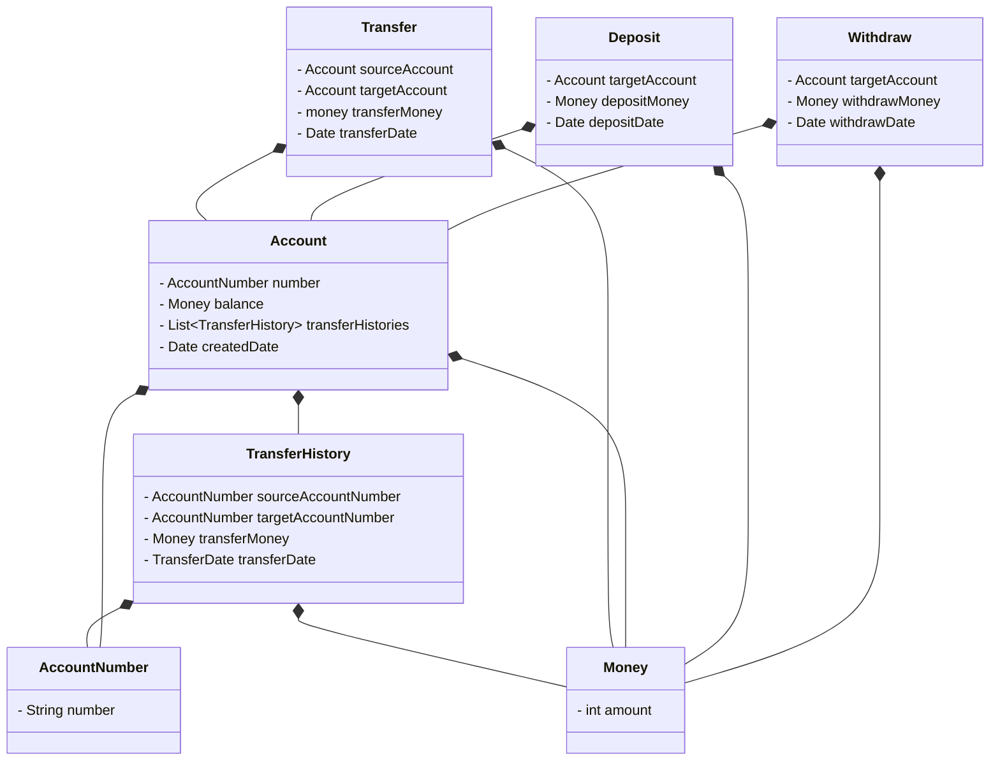
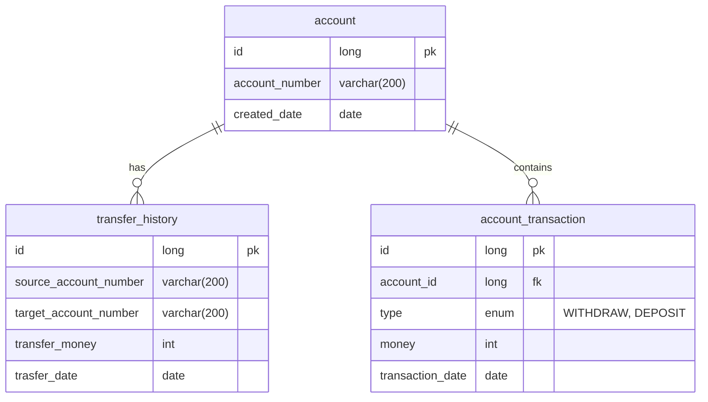

# 2주차

## 이츠 페이먼츠 ( EST's-Payments )

이스트소프트는 최근 금융사업과 관련하여 송금 서비스를 제공하기로 결정되었다. 각 서비스들은 MSA로 분리되어있다.
 

베타서비스를 위해, A2개발팀은 송금과 관련된 요구사항이 부여되었고 개발자들은 해당 요구사항을 토대로 개발을 진행해야한다.

## 요구사항

1. 사용자는 돈이 없으면 송금할 수 없다.
2. 동일한 송금은 두번 요청할 수 없다.
3. 송금 후에는 계좌잔액을 노출해야 한다.
4. 송금 내역은 5개월동안 보장되고 그 이후의 내역은 삭제되어야 한다.

> 송금 이력이 사라지기 때문에 계좌 잔액을 영속화하거나 송금 기록을 제외한 입출금 내역만을 관리해 계좌 잔액을 계산해야 한다.

## 요구사항 정제

- `계좌 번호`를 입력해 `계좌`를 생성한다.
    - `계좌 번호`는 10자리로 구성되어있다.
    - `계좌 번호`는 중복되어서는 안된다.
- `자신 계좌 번호`와 `상대방 계좌 번호` 그리고 `돈의 수량`을 입력해 송금을 진행 한 후 계좌 잔액을 노출한다.
    - `상대방 계좌 번호`가 존재하지 않으면 안된다.
    - `자신 계좌 번호`가 존재하지 않으면 안된다.
    - `자신 계좌 번호`와 `상대방 계좌 번호`가 동일하면 안된다.
    - `돈의 수량`은 0보다 커야한다.
    - `자신 계좌`에 잔액이 입력한 `돈의 수량`보다 많아야 한다.
    - 동일한 송금은 두번 요청할 수 없다.
    - `자신 계좌`에서 `상대방의 계좌`로 돈을 전달한다.
    - 송금한 기록을 남긴다. 송금 기록에는 `자신의 계좌 번호`, `상대방 계좌 번호`, `송금한 돈의 수량`, `송금한 일자`가 포함된다.
    - 송금 후 `자신 계좌` 잔액을 노출한다.
- `계좌 번호`, `돈의 수량`를 입력해 돈을 입급한다.
    - `계좌 번호`가 존재하지 않으면 안된다.
    - `돈의 수량`은 0보다 커야한다.
- `계좌 번호`, `돈의 수량`를 입력해 돈을 출금한다.
    - `계좌 번호`가 존재하지 않으면 안된다.
    - `돈의 수량`은 0보다 커야한다.
    - `계좌`에 잔액이 입력한 `돈의 수량`보다 많아야 한다.

## 모델링

| 한글        | 영어                 | 설명                                                              |
|-----------|--------------------|-----------------------------------------------------------------|
| 송금        | Transfer           | 송금에는 `송금한 계좌`, `송금받은 계좌`, `송금한 돈의 수량`, `송금한 일자`가 포함된다.          |
| 송금한 계좌    | sourceAccount      | 송금하려는 계좌 정보.                                                    |
| 송금받은 계좌   | targetAccount      | 송금받는 계좌 정보.                                                     |
| 송금한 돈의 수량 | transferMoney      | 송금할 돈의 수량.                                                      |
| 송금한 일자    | transferDate       | 송금한 일자는 송금한 날짜.                                                 |
| 계좌        | Account            | 계좌에는 `계좌 번호`, `생성 일자 정보`, `잔액 정보`, `송금 이력`을 포함한다.               |
| 계좌 번호     | AccountNumber      | 10자리로 구성된 고유한 값.                                                |
| 생성 일자     | createDate         | 계좌를 생성한 날짜.                                                     |
| 잔액        | balance            | 계좌에 남은 돈의 수량.                                                   |
| 송금 이력     | transferHistories  | 송금 이력에는 `송금한 계좌 번호`, `송금받은 계좌 번호`, `송금한 돈의 수량`, `송금한 일자`가 포함된다. |
| 돈         | Money              | 주고받는 돈의 기본 단위. 돈의 수량은 0 이상이어야 한다.                               |
| 입출금 이력    | transactionHistory | 입출금 이력에는 `계좌 번호`, `입출금 타입`, `돈의 수량`, `입출금 일자`가 포함된다.            |

### 입금

- `계좌 번호(AccountNumber)`와 `돈의 수량(Money)`을 입력해 돈을 입금한다.
- `계좌 번호(AccountNumber)`가 존재하지 않으면 안된다.
- `돈의 수량(Money)`은 0보다 커야한다.
- `입출금 이력(transactionHisotry)`에 `입금 기록(DEPOSIT)`을 추가한다.

### 출금

- `계좌 번호(AccountNumber)`와 `돈의 수량(Money)`을 입력해 돈을 출금한다.
- `계좌 번호(AccountNumber)`가 존재하지 않으면 안된다.
- `돈의 수량(Money)`은 0보다 커야한다.
- `계좌`에 잔액이 입력한 `돈의 수량(Money)`보다 많아야 한다.
- `입출금 이력(transactionHisotry)`에 `출금 기록(WITHDRAW)`을 추가한다.

### 송금

- `자신 계좌(sourceAccount)`와 `상대방 계좌(targetAccount)`, `송금 일자(transferDate)` 그리고 `돈의 수량(transferMoney)`을 입력해 송금한다.
- `상대방 계좌(targetAccount)`가 존재하지 않으면 안된다.
- `자신 계좌(sourceAccount)`가 존재하지 않으면 안된다.
- `자신 계좌(sourceAccount)`와 `상대방 계좌(targetAccount)`가 동일하면 안된다.
- `돈의 수량(transferMoney)`은 0보다 커야한다.
- `자신 계좌(sourceAccount)`의 `입출금 이력(transactionHisotry)`에는 `출금 기록(WITHDRAW)`을 추가한다.
- `상대방 계좌(targetAccount)`의 `입출금 이력(transactionHisotry)`에는 `입금 기록(DEPOSIT)`을 추가한다.

### 계좌

- 계좌에는 `계좌 번호(AccountNumber)`, `생성 일자 정보(createDate)`, `잔액 정보(balance)`, `송금 이력(transferHistories)`, `입출금 이력(transactionHisotry)`를 포함한다.
- `입출금 이력(transactionHisotry)` 에는 `계좌 번호(AccountNumber)`, `입출금 타입(type)`, `돈의 수량(Money)`, `입출금 일자(transactionDate)`가 포함된다.
- `입출금 이력(transactionHisotry)`으로 `잔액 정보(balance)`를 계산한다.
- `계좌 번호(AccountNumber)`는 10자리로 구성되어있다.
- `잔액 정보(balance)`는 0 이상이어야 한다.
- `송금 이력(transferHistories)` 에는 `송금한 계좌(sourceAccountNumber)`, `송금받은 계좌(targetAccountNumber)`, `송금한 돈의 수량(transferMoney)`, `송금한 일자(transferDate)`가 포함된다.

### 돈(Money)

- `금액 정보(amount)`가 포함된다.

### 클래스 다이어그램

## erd

